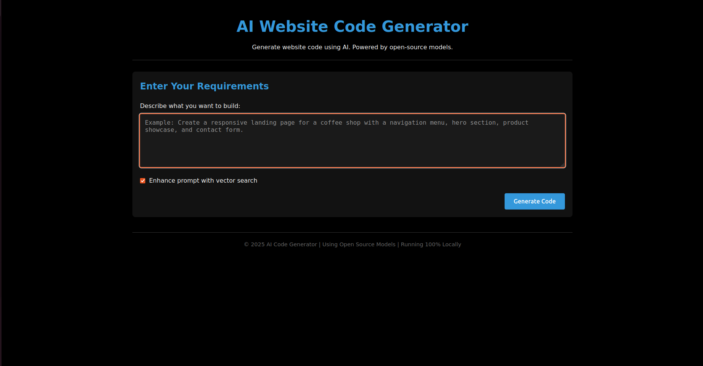

# AI Website Code Generator

A full-stack application that generates website code from natural language prompts using open-source models. This application runs locally and can operate even on systems with just 8GB of RAM.

## Features

- **AI-Powered Code Generation**: Transforms natural language descriptions into functional code.
- **Multiple Language Support**: Generates HTML, CSS, JavaScript, React, Node.js, and more.
- **Vector Search Enhancement**: Improves prompts by finding similar previous examples.
- **Local Operation**: Everything runs locally — no API keys or cloud services required.
- **Lightweight Model**: Uses DeepSeek Coder 1.3B that can run on CPU with 8GB RAM.
- **Code Preview**: View generated code with syntax highlighting.
- **File Management**: Download individual files or entire projects.

## System Requirements

- Python 3.8 or higher
- 8GB RAM
- ~2GB available disk space
- Internet connection (only for initial setup to download the model)

## Installation

1. Clone the repository:

```bash
git clone https://github.com/yourusername/ai-website-code-generator.git
cd ai-website-code-generator
```

2. Install backend dependencies:

```bash
cd backend
pip install -r requirements.txt
```

3. Ensure your project structure looks like this:

```bash
ai-website-code-generator/
├── backend/
│   ├── app.py
│   ├── model_handler.py
│   ├── database_handler.py
│   ├── file_handler.py
│   └── requirements.txt
├── frontend/
│   ├── index.html
│   ├── styles.css
│   └── script.js
├── output/
│   └── .gitkeep
└── run.py
```

## Usage

1. Start the application:

```bash
python run.py
```

2. The application will:
   - Start the backend server
   - Serve the frontend
   - Open your default browser at [http://localhost:8080](http://localhost:8080)

3. Enter your website requirements in the prompt field. For example:

```text
Create a responsive landing page for a coffee shop with a dark theme,
navigation menu, hero section with a call-to-action button, product
showcase section, and a contact form.
```

4. Click **"Generate Code"** to create your website.

5. View and download the generated files individually or as a project archive.

6. Generated code is saved locally under the `output/` directory, organized by session ID.

## Preview

Here’s a quick look at the frontend UI:



## How It Works

- **Backend (FastAPI)**:
  - Handles API requests and model management
  - Interacts with the vector database
  - Manages file operations

- **Model Layer**:
  - Uses DeepSeek Coder 1.3B model optimized for low-resource environments
  - Processes prompts and generates multi-language code

- **Vector Database (ChromaDB)**:
  - Stores and retrieves prompt history
  - Improves new prompt results using past examples

- **Frontend**:
  - Minimal black-themed UI
  - Syntax-highlighted code preview
  - File navigation and download options

## Customization

### Using a Different Model

Edit the `model_name` in `backend/model_handler.py` to switch models:

```python
# Example:
model_name = "deepseek-ai/deepseek-coder-1.3b-base"
```

Available options:
- `deepseek-ai/deepseek-coder-1.3b-base` (default)
- `Salesforce/codegen-350M-mono`
- `bigcode/starcoder-1b`

### Adjusting Generation Parameters

You can tune the generation settings in `backend/model_handler.py`:

```python
# Example parameters:
max_length = 2048
temperature = 0.7
top_p = 0.9
```

- `max_length`: Maximum token length
- `temperature`: Creativity vs determinism
- `top_p`: Controls output diversity

## Troubleshooting

### Model Download Issues
- Check your internet connection.
- Ensure you have ~2GB of free disk space.
- Retry running the application.

### Memory Issues
- Close unnecessary applications to free up RAM.
- Use a smaller model like `Salesforce/codegen-350M-mono`.
- Decrease `max_length` in the generation parameters.

### Port Conflicts
- Ensure ports **8000** and **8080** are free.
- To change ports, edit `app.py` and `run.py`.

## Acknowledgments

This project makes use of several open-source libraries and models:
- [DeepSeek Coder](https://github.com/deepseek-ai/deepseek-coder) for code generation
- [FastAPI](https://fastapi.tiangolo.com/) for the backend server
- [ChromaDB](https://www.trychroma.com/) for vector database
- [Sentence-Transformers](https://www.sbert.net/) for text embeddings
- [Highlight.js](https://highlightjs.org/) for syntax highlighting in the frontend

## Contributing

Contributions are welcome!  
Feel free to fork this repository, submit an issue, or open a Pull Request.
